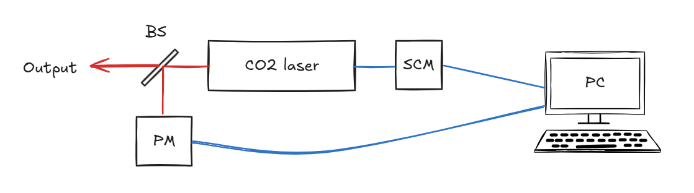
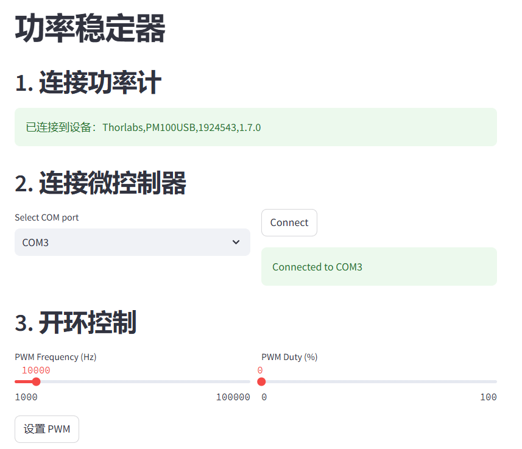
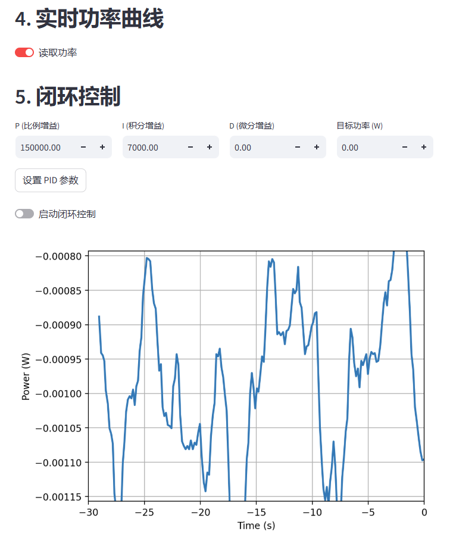
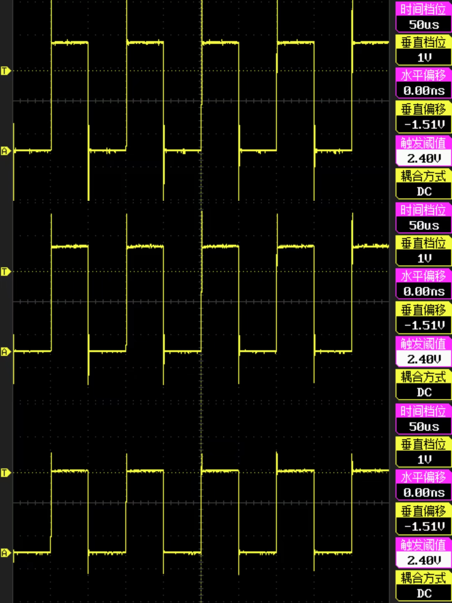
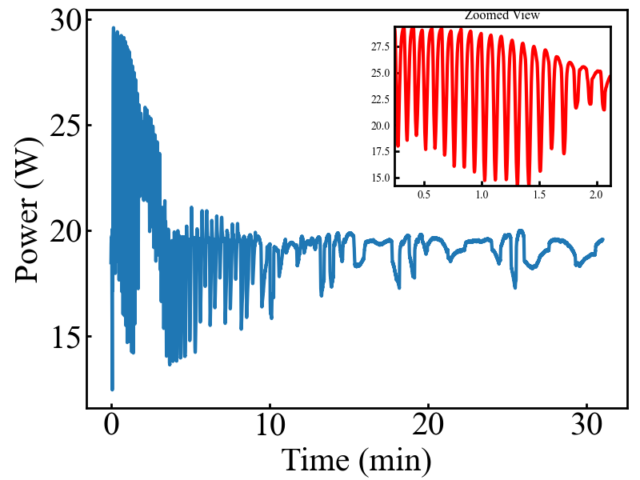
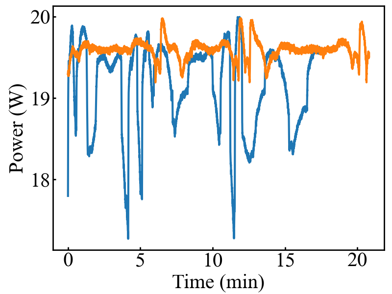

# 射频二氧化碳激光器功率稳定装置

> 摘要：
>
> 本项目制作了一个闭环反馈功率稳定器，
> 适用于使用PWM占空比调节功率的射频二氧化碳激光器。
> 通过反馈调节显著提升了功率稳定性，
> 经测试可以将±7%的功率波动稳定至±2%。
> 对于精密的表面处理、切割和焊接等应用可以有效提升加工均匀性。

## 1. 项目背景

二氧化碳激光器具有能量转换效率高、光束质量好、
稳定性高、输出功率高等优点，
因此在工业领域有着广泛的应用，
如表面处理、激光切割、焊接和钻孔等。
市面上常见的二氧化碳激光器的功率稳定性约为±5%，
虽然足以满足多数应用需求，
但是对于高速或高精度的激光加工作业，
功率波动会造成加工不均匀，
影响工件质量。

射频二氧化碳激光器可以通过调节触发信号的占空比改变激光器功率，
因此可以对输出功率进行采样，
反馈调节占空比，
降低功率波动幅度。
部分厂家提供了带有反馈调节功能的激光器，
但价格十分昂贵，
往往高达普通激光器的数十倍。
因此，
本项目提出了一种使用功率计进行采样，
使用单片机输出脉冲信号的通用性功率稳定装置，
可以以较低的成本实现射频二氧化碳激光器的功率稳定。

## 2. 硬件

*图1. 功率稳定装置结构示意图*

图1是本项目的硬件结构示意图，
二氧化碳激光器的输出光通过一个分束镜反射出一部分进入功率计，
电脑采集功率计的读数，
根据功率设定合适的占空比，
并告知单片机产生对应的脉冲信号，
信号输入到激光器中，实现反馈调节。

其中分束镜可以使用常见的高透射率硒化锌窗口镜，
这类镜片镀膜后透射率通常可以达到99%左右，
余下的1%反射足以使功率计准确的采样。

需要注意的是单片机输出的脉冲信号峰值电压多为3.3V，
不同激光器对触发信号电压的要求可能不同，
可以根据需要加入一个PWM信号放大器。
另外还需要观察PWM波形，
如果有明显的振铃效应（Ringing effect）,
可以通过并联电阻尝试解决。

另外，
由于这个波长的功率计都是热敏功率计，
对环境温度较为敏感，
需要注意功率计的放置位置，
尽量不要受到热量和气流的影响。
即使是带有温度补偿功能的激光器在温度突然变化时也会产生很大的测量误差。

本项目使用的器件如下表所示：

| 器件 | 厂家 | 型号 | 售价 |
| ---- | ---- | ---- | ---- |
| 激光器 | 南京博斯特 | T30A | 7000 |
| 分束镜 | 赓旭光电 | 定制 | 450 |
| 功率计 | Thorlabs | S401C | 7500 |
| 采集卡 | Thorlabs | PM100USB | 4300 |
| 单片机 | Createblock | esp32 pico | 24 |
| 屏幕（可选）| - | 1.3寸IIC OLED | 28 |
| PWM信号放大器（可选） | - | - | 约25 |

## 3. 软件

本项目使用的软件分为PC端和单片机端两部分，
PC端使用Python编写，
实现了Thorlabs功率计的控制和读数，
单片机的通信，
闭环控制算法和数据存储功能。
并且用`streamlit`实现了图形界面。
单片机端使用`MicroPython`编写，
实现了与PC的串口信号接收，
PWM信号产生和屏幕的驱动。

所有软件代码在Github完全开源，
遵循MIT协议，
如有需要请遵守协议使用。

*图2. 软件界面 - 1*

在成功连接功率计和单片机之后，
即可通过开环控制设置PWM参数，
如图2所示。
本项目所使用的激光器在5 Hz、
10 kHz、 20 kHz的脉冲频率下没有显著区别，
请根据激光器说明书选择合适的频率。

*图3. 软件界面 -2*

打开实时功率曲线后就会展示最近30秒的功率读数，
如图3所示。
当激光器达到热平衡后，
调整PID参数和目标功率，
即可启动闭环控制，
实现功率稳定功能。

在关闭闭环控制和功率读取之后，
程序提供了本次实验的数据保存功能和安全断开连接的功能。

## 4. 实验

本项目使用的激光器与单片机信号没有很好的阻抗匹配，
存在明显的振铃效应，通过并联电阻可以得到适当的抑制。
图4展示了没有并联电阻、
并联10 KΩ电阻和100 Ω电阻情况下的脉冲波形。

*图4. 没有并联电阻、并联10 KΩ电阻和100 Ω电阻情况下的PWM波形*

本项目使用的激光器需要大约20分钟的预热以达到热平衡，
如图5所示。
在刚开机的阶段，
激光器会有频繁的大幅度波动。
达到热平衡之后，
激光功率波动为±7.11%，
其标准差为0.53 W。

*图5. 激光器预热过程，子图为局部放大*

在开启反馈调节后，
激光功率稳定性得到明显改善。
图6展示了开启反馈调节与不开启反馈调节的对比。
稳定后的激光功率波动为±2.01%，
其标准差为0.12 W。
这一参数已经超过了绝大部分市售二氧化碳激光器。

*图6. 开启反馈调节（橙色）与不开启反馈调节（蓝色）的对比*

## 5. 总结

对于本实验使用的激光器，
使用简单的PID算法已经很难进一步提升稳定性。
因为其自身功率波动幅度较大、腔模较多，
而且既存在缓慢波动，又存在突然波动的情况。
通过加入模糊控制有望实现更好的稳定效果。

更高的测量、调节频率有利于进一步稳定功率，
但是在10.6 μm波长适用的功率计都是热敏功率计，
响应时间通常在秒量级，
因此难以实现很高频率的测量。

本实验中使用了一台电脑读取功率和实现算法，
这并不是必须的。
`esp32`芯片带有10 bit的模数转换，
可以直接读取功率计的模拟量输出。
使用这一原理可以实现模块式的控制系统。

很多实验室广泛使用LabView进行开发，
也可以参考本项目，
使用兼容LabView的PWM信号发生器实现相同的功能。

综上所述，
本项目实现了一个低成本的射频二氧化碳激光器功率稳定装置，
将原本激光器±7.11%的功率波动降低至±2.01%，
有助于实现更均匀稳定的激光加工工艺。
